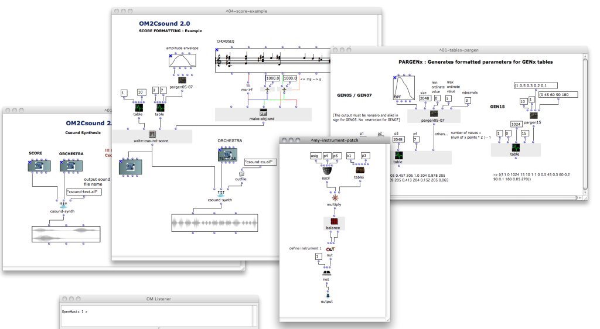

# OM2Csound

Csound audio processing and synthesis in OpenMusic

The OM2Csound library is inially an adaptation of the **Csound/Edit-sco** library for PatchWork, by Laurent Pottier and Mikhaïl Malt.

This libray allows to generate Csound "scores" and "orchestras", as well as to format Csound tables using the OM graphic and programming tools.

Csound basic knowledge is required to use this library efficiently, although provided example patch may constitute a base to start learning and doing synthesis with it.

Find more information about Csound on www.csounds.com.

The OM2Csound library was conceived and programmed by Karim Haddad, Mikhail Malt, Laurent Pottier, Jean Bresson.

A manual for OM2Csound was published in 1999 by Ircam: http://support.ircam.fr/docs/om-libraries/old/
